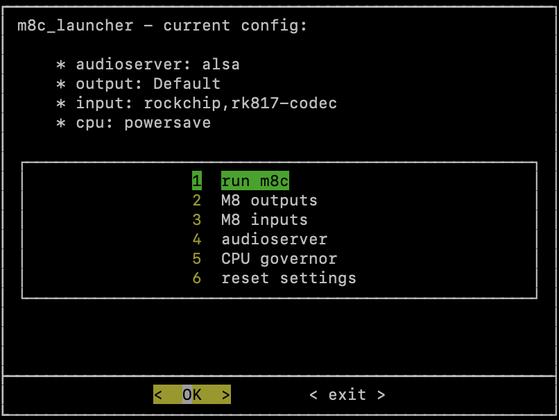

README.md


A launcher for the [M8 Headless Tracker](https://github.com/Dirtywave/M8HeadlessFirmware), based on [rg351_m8c](https://github.com/jasonporritt/rg351_m8c) to easily configure the M8 inputs and outputs, the cpu governor and audioserver.



This launcher should work for Anbernic's rg353m and rg353 family. Instructions will focus on [ArkOS](https://github.com/christianhaitian/arkos).

# Download a release

https://github.com/totoetlititi/m8c_launcher/releases

# Setup:

1. Install [rg351_m8c v0.1.5](https://github.com/jasonporritt/rg351_m8c/releases/tag/v0.1.5) following [rg351_m8c](https://github.com/jasonporritt/rg351_m8c) instructions:
	- Copy the M8 folder from [rg351_m8c v0.1.5](https://github.com/jasonporritt/rg351_m8c/releases/tag/v0.1.5) to  `/roms/ports/` (or `/roms2/ports/ if you are using the second SD card on your Anbernic device)
	- Install `libserialport0`: `sudo apt-get --assume-yes install libserialport0`
2. Copy `m8c_launcher.sh` to the M8 folder.
3. Restart EmulationStation
4. Connect your Teensy 4.1 M8 Headless, ==only when emulationstation is loaded==
5. Go to `PORTS`, then `M8`, and run `m8c_launcher`

## Alsa 

To enable the internal rg353m microphone, update your `~/.asoundrc`
```
pcm.!default {
    type            asym
    playback.pcm {
        type        plug
        slave.pcm   "softvol"
    }
    capture.pcm {
        type        plug
        slave.pcm   "asymed"
    }
}

pcm.default {
    type            asym
    playback.pcm {
        type        plug
        slave.pcm   "softvol"
    }
    capture.pcm {
        type        plug
        slave.pcm   "asymed"
    }
}

ctl.!default {
    type            hw 
    card            0
}

pcm.ddmix {
    ipc_key         1024
    type            dmix
    slave {
        pcm         "hw:0,0"
        period_time 0
        period_size 1024
        buffer_size 4096
        rate 44100
    }
}

pcm.softvol {
    type            softvol
    slave {
        pcm         "ddmix"
    }

    control {
        name        "Master"
        card        0
    }
}

pcm.asymed {
    type asym
    capture.pcm "hw:0,0"
}
```


## Pulseaudio

To use Pulseaudio you need to install it, via ssh:
`sudo apt-get --assume-yes install pulseaudio`

Add $USER in dialout group:
`sudo adduser $USER dialout`

Fix the fact that pulseaudio only works in root mode:
`sudo chown -R $USER:$USER $HOME/`

To prevent pulseaudio from auto spawning:
```
systemctl --user stop pulseaudio.socket
systemctl --user stop pulseaudio.service
systemctl --user disable pulseaudio.socket
systemctl --user disable pulseaudio.service
systemctl --user mask pulseaudio.socket
systemctl --user mask pulseaudio.service
```

# Launcher
The top of the screen displays the last used configuration.

## 1. run m8c
Runs the m8c software according to the configuration.
Exiting the m8c software, will exit the **m8c_launcher**.
If audioserver is set to pulse, a config.pulse.pa file is created for pulseaudio deamon.

## 2. M8 outputs
Set the sound interface to output sound from the M8. 
`Default` only works with Alsa audioserver. It uses the internal sound interface, letting the volume buttons control the output volume of M8.
`Default` by default.

## 3. M8 inputs
Set the sound interface to send audio to the M8. `rockchip.rk817-codec` by default

## 4. audioserver
Set the audioserver: `alsa` by default.

## 5. CPU governor
Set the CPU governor to prevent click, `powersave` by default.

## 6. reset settings
Reset everything to default values.

# Issues
- EmulationStation is not very friendly to m8c, stopping alsa or pulse regulary. **m8c_launcher** scans every seconds if pulse or alsa is running, restarting it in case of problem. So expect some "short abrupt silences" sometimes.
- There is no check if the previous configuration is still possible. Make sure to have the same sound interfaces connected before running m8c, or update your settings according to your available devices. 
- In case of crash, `oga_controls` will not be killed. The result is that the D-pad control is chaotic in the emulationstation. If this happens, restart your console, or kill the process via ssh: `sudo pkill oga_controls`
- Be sure to not start the console with the M8 connected. Otherwise, alsa will use it as the default output device, and you won't get any sounds in your other games. Simply restart the console without the teensy connected.
- The console volume controls only work with alsa audioserver, and `Default` M8 outputs.
- Exiting in m8c sample edition window, makes the console to be redirected to tty2. A forced redirection to tty1 is done to prevent to be stuck in tty2.

# Dialog themes
For a better true black themes, edit your `~/dialogrc` with:
```
#
# Run-time configuration file for dialog
#
# Automatically generated by "dialog --create-rc <file>"
#
#
# Types of values:
#
# Number     -  <number>
# String     -  "string"
# Boolean    -  <ON|OFF>
# Attribute  -  (foreground,background,highlight?)

# Set aspect-ration.
aspect = 0

# Set separator (for multiple widgets output).
separate_widget = ""

# Set tab-length (for textbox tab-conversion).
tab_len = 0

# Make tab-traversal for checklist, etc., include the list.
visit_items = OFF

# Shadow dialog boxes? This also turns on color.
use_shadow = OFF

# Turn color support ON or OFF
use_colors = ON

# Screen color
screen_color = (WHITE,DEFAULT,OFF)

# Shadow color
shadow_color = (WHITE,BLACK,OFF)

# Dialog box color
dialog_color = (WHITE,BLACK,OFF)

# Dialog box title color
title_color = (GREEN,BLACK,OFF)

# Dialog box border color
border_color = (WHITE,BLACK,ON)

# Active button color
button_active_color = (BLACK,YELLOW,OFF)

# Inactive button color
button_inactive_color = (WHITE,BLACK,OFF)

# Active button key color
button_key_active_color = (BLACK,GREEN,OFF)

# Inactive button key color
button_key_inactive_color = (RED,BLACK,OFF)

# Active button label color
button_label_active_color = (BLACK,YELLOW,OFF)

# Inactive button label color
button_label_inactive_color = (WHITE,BLACK,OFF)

# Input box color
inputbox_color = (WHITE,BLACK,OFF)

# Input box border color
inputbox_border_color = (BLACK,BLACK,OFF)

# Search box color
searchbox_color = (WHITE,BLACK,OFF)

# Search box title color
searchbox_title_color = (GREEN,BLACK,OFF)

# Search box border color
searchbox_border_color = (WHITE,BLACK,OFF)

# File position indicator color
position_indicator_color = (GREEN,BLACK,OFF)

# Menu box color
menubox_color = (BLACK,BLACK,OFF)

# Menu box border color
menubox_border_color = (WHITE,BLACK,OFF)

# Item color
item_color = (WHITE,BLACK,OFF)

# Selected item color
item_selected_color = (BLACK,GREEN,OFF)

# Tag color
tag_color = (BLUE,BLACK,OFF)

# Selected tag color
tag_selected_color =  (BLACK,GREEN,OFF)

# Tag key color
tag_key_color = (YELLOW,BLACK,OFF)

# Selected tag key color
tag_key_selected_color = (BLACK,GREEN,OFF)

# Check box color
check_color = (WHITE,BLACK,OFF)

# Selected check box color
check_selected_color = (BLACK,GREEN,OFF)

# Up arrow color
uarrow_color = (GREEN,BLACK,OFF)

# Down arrow color
darrow_color = (GREEN,BLACK,OFF)

# Item help-text color
itemhelp_color = (BLACK,WHITE,OFF)

# Active form text color
form_active_text_color = (BLACK,BLUE,OFF)

# Form text color
form_text_color = (WHITE,BLACK,OFF)

# Readonly form item color
form_item_readonly_color = (BLACK,WHITE,OFF)

# Dialog box gauge color
gauge_color = title_color

# Dialog box border2 color
border2_color = dialog_color

# Input box border2 color
inputbox_border2_color = dialog_color

# Search box border2 color
searchbox_border2_color = dialog_color

# Menu box border2 color
menubox_border2_color = dialog_color
```


